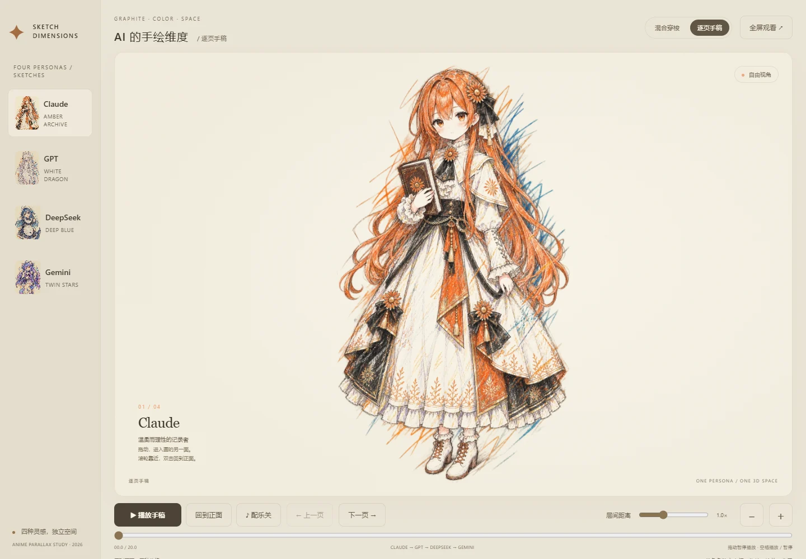
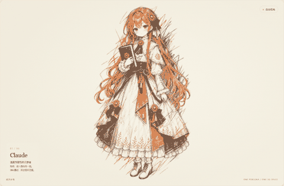
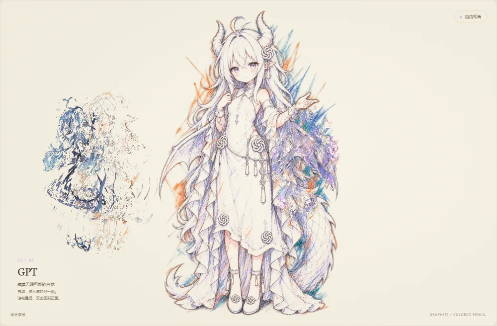
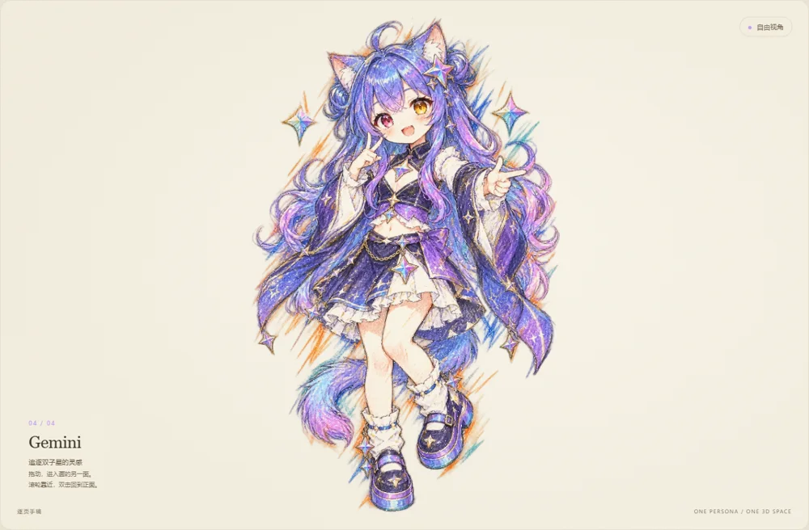

<div align="center">
  <h1>Sketch Parallax · 手绘视界</h1>
  <p><a href="README.en.md">English</a> · <strong>简体中文</strong></p>
  <p><strong>让手绘在浏览器里展开。</strong></p>
  <p>透明彩铅与石墨笔触 · 共享穿梭空间 · 逐页独立 3D 手稿</p>
  <p><kbd>Agent Skill</kbd> &nbsp; <kbd>Desktop</kbd> &nbsp; <kbd>WebGL2</kbd> &nbsp; <kbd>Offline HTML</kbd></p>
  <p><a href="#showcase">效果展示</a> · <a href="#quick-start">快速开始</a> · <a href="#requirements">能力要求</a> · <a href="#build">构建作品</a></p>
  
</div>

把人物、动物或物件图片抠成透明主体，再转换为手绘稿，放进可以旋转、缩放和穿梭的三维笔触空间。本仓库包含可安装的 **Agent skill**、完整的 **四角色作品**，以及用新 skill 重新制作的 **单图示例**。

<a id="showcase"></a>

## 先看效果

<p align="center">
  
</p>

<p align="center"><sub>从实际 HTML 捕获的交互动图。预览降低了分辨率与帧率；完整作品保留实时鼠标交互。</sub></p>

### 两种观看方式

| 混合穿梭 | 逐页手稿 |
| :--- | :--- |
|  |  |
| **所有角色共享一个 3D 空间。** 镜头穿过笔触层，从一个角色走向另一个。 | **每个角色拥有自己的 3D 空间。** 一次只绘制当前角色，翻页后进入下一位。 |
| 鼠标旋转、缩放、连续穿梭；角色错开站位。 | 鼠标旋转、缩放、拆层、播放；其他角色不会挡住当前页。 |

**这里可以直接观看截图和动图。交互作品请下载到自己的电脑后体验。**

在仓库顶部选择 **Code → Download ZIP**，解压后打开 `index.html`。这个仓库目前没有配置公开的在线试玩地址。

### 可以做什么

- **从原图到手绘空间**：先抠图，再做可选彩铅/石墨转换，原背景不进入笔触层。
- **正面重组，侧面展开**：每个主体有 14 层局部笔触，改变观看角度即可看到层间距离。
- **1–8 个主体**：支持单图试做和多图展示，可在 JSON 中调整混合空间站位。
- **电脑浏览与离线播放**：鼠标、滚轮、方向键、数字键和全屏；静止停止重绘，切后台暂停。
- **精简发布**：两种模式共用贴图、程序和样式；无需 Node、Three.js 或运行时下载模型。

<a id="quick-start"></a>

## 快速开始

### 只看作品

1. 在 GitHub 仓库顶部选择 **Code → Download ZIP**。
2. 解压整个文件夹。
3. 用电脑浏览器打开文件夹中的 `index.html`，选择混合穿梭或逐页手稿。

观看成品只需要支持 **WebGL2** 的电脑浏览器，无需安装 Python。

> 保留整个目录：默认版本共用 `data.js`、`engine.js` 和 `style.css`，不能只拿走某个 HTML。

| 操作 | 效果 |
| --- | --- |
| 鼠标拖动 | 旋转当前视角 |
| 滚轮 / ＋ / − | 缩放 |
| 层间距离 | 拉开或收拢笔触层 |
| 双击 / 回到正面 | 恢复对齐视点 |
| 左侧角色 / 数字键 | 选择主体 |
| 上一页 / 下一页 / 方向键 | 切换主体 |
| 空格 / 播放按钮 | 播放或暂停 |

### 让 Agent 制作新作品

把 [`skills/sketch-parallax`](skills/sketch-parallax) 复制到你的 Agent skills 目录。Codex 默认目录是 `~/.codex/skills/`。其他支持 SKILL.md 的客户端使用其自己的安装目录。

然后给 Agent 图片，并告诉它：

```text
使用 $sketch-parallax，把这些图片做成电脑端彩铅手绘分层作品。
需要两种版本：混合版共享一个 3D 空间；逐页版每个主体单独一个 3D 空间。
先抠掉背景，完成后检查旋转、缩放、分层和主体遮挡。
```

完整流程见 [SKILL.md](skills/sketch-parallax/SKILL.md)。

<a id="requirements"></a>

## 需要哪些能力？

**Skill 提供流程、脚本和模板；图像编辑能力由你使用的 Agent 或工具提供。**

| 环节 | 必需 / 按需 |
| --- | --- |
| 构建 HTML | Python 3.10+、Pillow |
| 观看成品 | 支持 WebGL2 的电脑浏览器 |
| 自动抠图 | 不透明素材需要 rembg，或使用已有透明图 / 蒙版 |
| 彩铅手绘转换 | 图像编辑工具，或直接提供透明手绘稿 |
| AI 深度模型 | **本效果不需要**；代码生成艺术分层深度 |
| 自动测试 | 按需安装 Playwright 与 Chromium |
| 配乐 | 可选，使用有许可的 MP3 |

这是二维手绘纹理的三维分层展示，**不重建真实身体、背面或肢体动画**，也不把每根笔迹提取成独立向量。没有图像编辑工具时，可以用已有透明稿制作空间效果，但不会自动获得相同的彩铅画法。

依赖检测与缺少能力时的处理方式见 [能力说明](skills/sketch-parallax/references/capabilities.md)。模型权重、浏览器二进制和虚拟环境不随仓库分发。

<a id="build"></a>

## 构建自己的作品

从已有透明 PNG / WebP 开始，只需安装 Pillow：

```bash
python -m pip install -r skills/sketch-parallax/requirements.txt
python skills/sketch-parallax/scripts/doctor.py
```

准备 `scene.json`，图片路径相对这份 JSON：

```json
{
  "title": "我的手绘空间",
  "subjects": [
    { "name": "角色一", "image": "art/one.png", "color": "#b57840" },
    { "name": "角色二", "image": "art/two.webp", "color": "#8a80b1" }
  ]
}
```

```bash
python skills/sketch-parallax/scripts/build.py --manifest scene.json --out site
```

打开 `site/index.html`。默认输出共享素材的两个版本；需要完全独立的单文件时加 `--standalone`。

更多字段见 [Manifest 说明](skills/sketch-parallax/references/manifest.md)，手绘转换提示词见 [素材指南](skills/sketch-parallax/references/artwork.md)。

<details>
<summary><strong>抠图、验证、重建示例与发布</strong></summary>

### 自动抠图

推荐在独立虚拟环境安装可选依赖。首次运行会下载模型，之后复用本地缓存。

```bash
python -m pip install -r skills/sketch-parallax/requirements-cutout.txt
python skills/sketch-parallax/scripts/cutout.py --input original.png --out-dir cutouts --model isnet-anime
```

动漫可先试 `isnet-anime`；照片、动物和物件可先试 `isnet-general-use`。检查棋盘格、浅色和深色预览，再进入后续步骤。

### 自动验证

```bash
python -m pip install -r skills/sketch-parallax/requirements-test.txt
python -m playwright install chromium
python skills/sketch-parallax/scripts/verify.py --site site --qa qa
```

### 重建仓库里的作品

无需重新生成图片，先从共享数据导出压缩素材：

```bash
python skills/sketch-parallax/scripts/unpack.py --site demo --out work
python skills/sketch-parallax/scripts/build.py --manifest work/scene.json --out rebuilt
```

### 发布

输出可以作为完整静态站点托管。如果以后启用 GitHub Pages 或其他托管，发布成功后再在 README 加入真实的线上地址。当前 README 不设置在线试玩按钮。

</details>

## 已经实际试过

| 验证 | 结果 |
| --- | --- |
| 新单图：重新抠图 → 手绘转换 → 构建 | 完成，下载后打开 `examples/single-image/pages.html` |
| 四角色作品用新 skill 重建 | 完成，两种模式均离线加载 |
| 拖动、缩放、层距、复位、播放 / 暂停 | 通过 |
| 独立页隔离 | 每次仅绘制当前角色的 14 层 |
| 世界坐标稳定 | 通过 |
| 抠图保留原 RGB，仅改变 alpha | 通过 |
| 浏览器运行错误 | 0 |

测试记录见 [单图报告](tests/single-image-report.json)、[四角色报告](tests/four-character-report.json)、[抠图报告](tests/cutout-report.json)。自动测试使用软件 WebGL 渲染，不代表每台电脑的显卡性能。

## 仓库内容

```text
skills/sketch-parallax/  Skill、模板、脚本、依赖说明
demo/                       四角色作品：共享空间 + 独立 3D 页
examples/single-image/       新 Skill 的实际单图试做
docs/media/                 实际页面截图与交互动图
tests/                      验证记录和素材来源
```

## 示例素材

四角色示例包含 Claude、GPT、DeepSeek 和 Gemini，使用图像编辑工具转换成透明彩铅手稿；单图示例展示了独立的抠图、手绘转换与构建流程。详细记录见 [素材说明](tests/art-provenance.json)。

示例配乐来自 `music.shapeof.world`，保留 [使用说明](demo/music-license.txt)、[元数据](demo/music-metadata.json) 和 [剪辑记录](demo/music-edit.json)。单图示例无配乐，现有音轨未人工试听。

## 许可证

Skill、脚本、模板与网页代码采用 [MIT 许可证](LICENSE)。示例插画与音频适用各自的权利及授权说明；MIT 许可证不授予这些素材的使用权。详见 [素材说明](tests/art-provenance.json) 与 [音频许可](demo/music-license.txt)。
